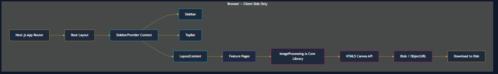
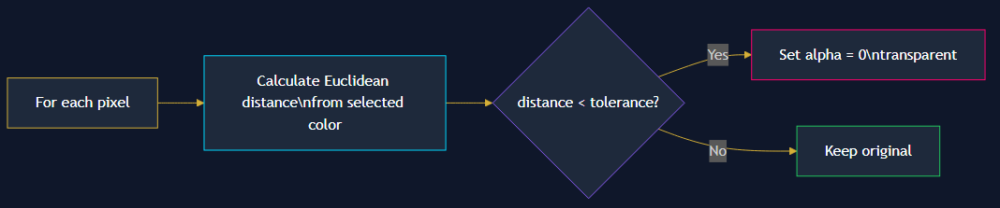
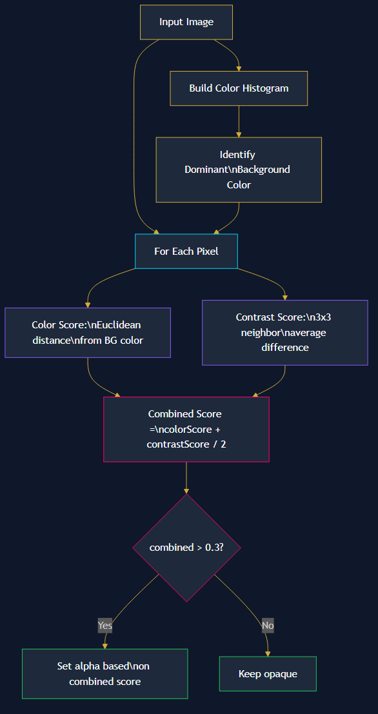
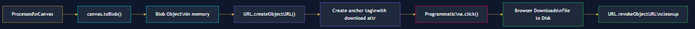
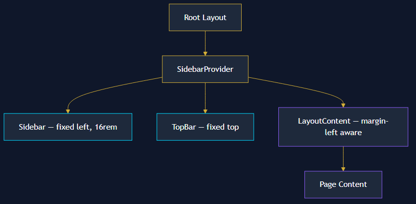
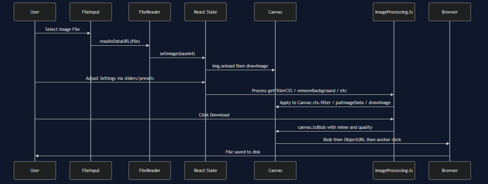

## Getting Started

First Clone the project :

```bash
git clone https://github.com/Zenous07/ImageLab.git
```

Then move into the directory:

```bash
cd ImageLab
```

Then install dependencies:

```bash
npm install
```

Next, run the development server:

```bash
npm run dev
# or
yarn dev
# or
pnpm dev
# or
bun dev
```

Open [http://localhost:3000](http://localhost:3000) with your browser to see the result.

# ImageLab — Complete Product Research Report

## 1. Executive Summary

**ImageLab** is a fully **client-side**, privacy-first image processing web application built with **Next.js 16** (App Router) and **React 19**. It provides 8 professional image editing tools — all running entirely in the user's browser with **zero server-side processing**. Images never leave the device.

| Attribute | Detail |
|---|---|
| **Framework** | Next.js 16.1.6 (App Router) |
| **UI Library** | React 19.2.3 |
| **Styling** | Tailwind CSS v4 + Vanilla CSS |
| **Animations** | GSAP (ScrollTrigger) + CSS keyframes |
| **Typography** | Space Grotesk (headings), Space Mono (body) |
| **Processing** | 100% client-side via HTML5 Canvas API |
| **Image Formats** | JPG, PNG, WebP (export) |

---

## 2. Application Architecture

### 2.1 High-Level Architecture

The following diagram shows the complete client-side architecture of ImageLab, from the Next.js App Router down to the download mechanism:



**No server-side processing exists.** Every image operation — filters, background removal, compression, cropping, resizing, rotation, watermarking — happens entirely within the browser using the Canvas 2D API. No images are uploaded to any server.

### 2.2 Directory Structure

```
imgprocess/
├── app/
│   ├── layout.tsx              # Root layout (fonts, sidebar, topbar)
│   ├── page.tsx                # Homepage / dashboard
│   ├── globals.css             # Global styles & animations
│   ├── filters/page.tsx        # Image Filters tool
│   ├── bg-changer/page.tsx     # Background Color Changer
│   ├── bg-remover/page.tsx     # Background Remover (4 algorithms)
│   ├── compressor/page.tsx     # Image Compressor
│   ├── cropper/page.tsx        # Image Cropper
│   ├── resize/page.tsx         # Image Resizer
│   ├── rotate/page.tsx         # Rotate & Flip
│   └── watermark/page.tsx      # Watermark & Text Overlay
├── components/
│   ├── Sidebar.tsx             # Draggable navigation sidebar
│   ├── TopBar.tsx              # Fixed top navigation bar
│   └── LayoutContent.tsx       # Main content wrapper (sidebar-aware)
├── context/
│   └── SidebarContext.tsx      # Sidebar open/close state
└── lib/utils/
    └── imageProcessing.ts      # Core processing engine (642 lines)
```

### 2.3 Routing Architecture

The app uses **Next.js App Router** with file-based routing. Each tool is a separate route:

| Route | Feature | Component |
|---|---|---|
| `/` | Dashboard / Home | `app/page.tsx` |
| `/filters` | Image Filters | `app/filters/page.tsx` |
| `/bg-changer` | Background Changer | `app/bg-changer/page.tsx` |
| `/bg-remover` | Background Remover | `app/bg-remover/page.tsx` |
| `/compressor` | Image Compressor | `app/compressor/page.tsx` |
| `/cropper` | Image Cropper | `app/cropper/page.tsx` |
| `/resize` | Image Resize | `app/resize/page.tsx` |
| `/rotate` | Rotate & Flip | `app/rotate/page.tsx` |
| `/watermark` | Watermark & Text | `app/watermark/page.tsx` |

All feature pages are **client components** (`"use client"`) since they depend on Canvas API, `FileReader`, and browser-only APIs.

### 2.4 State Management

- **No external state library** (no Redux, Zustand, etc.)
- **React `useState`** for all local/feature state (filter values, crop coordinates, etc.)
- **React Context** for sidebar state only (`SidebarContext.tsx`)
- **`localStorage`** for persisting custom filter presets

---

## 3. Core Processing Engine

All image processing is centralized in a single utility module:

**`lib/utils/imageProcessing.ts`** — 642 lines, 20+ exported functions

### 3.1 Processing Domain

**All processing operates in the spatial domain.** There is NO conversion to frequency domain (no FFT, no Fourier transforms, no wavelet transforms). All operations work directly on pixel RGB/A values or use the Canvas 2D context's built-in CSS filter pipeline.

The application uses two distinct processing approaches:

| Approach | Used By | How It Works |
|---|---|---|
| **CSS Filter Pipeline** | Filters (brightness, contrast, saturation, blur, grayscale, sepia) | Sets `ctx.filter` on the Canvas 2D context with CSS filter strings. The browser's GPU-accelerated rendering engine applies the filters. |
| **Direct Pixel Manipulation** | Background Changer, Background Remover, Watermark | Reads raw `ImageData` (RGBA arrays), iterates over every pixel, and modifies values directly. |
| **Canvas Geometric Transforms** | Crop, Resize, Rotate, Flip, Compress | Uses `ctx.drawImage()` with source/destination rectangles, `ctx.translate()`, `ctx.rotate()`, and `ctx.scale()` for geometric operations. |

---

## 4. Feature-by-Feature Deep Dive

### 4.1 Image Filters

**Route:** `/filters` — **File:** `app/filters/page.tsx`

#### How Filters Are Applied

Filters use the **CSS Filter API on Canvas 2D context** — a spatial-domain operation:

```typescript
// From imageProcessing.ts — getFilterCSS()
export function getFilterCSS(settings: FilterSettings): string {
  return `
    brightness(${settings.brightness}%)
    contrast(${settings.contrast}%)
    saturate(${settings.saturation}%)
    blur(${settings.blur}px)
    grayscale(${settings.grayscale}%)
    sepia(${settings.sepia}%)
  `.trim().replace(/\s+/g, ' ');
}
```

The generated CSS filter string is applied directly to the Canvas context:

```typescript
ctx.filter = filterCSS;   // Apply CSS filters
ctx.drawImage(img, 0, 0); // Redraw with filters
```

#### Filter Parameters

| Filter | Range | Default | Domain | Technique |
|---|---|---|---|---|
| **Brightness** | 0–200% | 100% | Spatial | Linear scaling of RGB channels |
| **Contrast** | 0–200% | 100% | Spatial | Midpoint-relative scaling |
| **Saturation** | 0–200% | 100% | Spatial | HSL saturation adjustment |
| **Blur** | 0–20px | 0px | Spatial | Gaussian blur (box filter approximation) |
| **Grayscale** | 0–100% | 0% | Spatial | Weighted luminance conversion |
| **Sepia** | 0–100% | 0% | Spatial | Color matrix transformation |

> **Note:** The **blur** filter uses the browser's built-in CSS `blur()` which applies a **Gaussian convolution kernel** — this is a spatial-domain convolution, NOT a frequency-domain operation. While a Gaussian blur *can* be computed via FFT in the frequency domain, the CSS/Canvas implementation performs it as a direct spatial convolution.

#### Built-in Presets (8 total)
Original, Vintage, Cool Blue, Warm Sunset, B&W Classic, Noir, Vivid, Soft Focus, Dream

#### Custom Presets
Users can save/load/delete custom filter combinations. Stored in `localStorage` under key `customFilterPresets`.

#### Undo/Redo System
Maintains a **linear history stack** of `FilterSettings` snapshots. Truncates forward history on new changes (standard undo behavior).

---

### 4.2 Background Color Changer

**Route:** `/bg-changer` — **File:** `app/bg-changer/page.tsx`

#### How It Works

This is a **two-pass pixel manipulation** algorithm:

**Pass 1 — Color-Based Transparency** (in `replaceBackgroundColor`):

The following diagram illustrates the first pass of the background replacement algorithm:



The **Euclidean distance** in RGB space is used:

```
distance = √((r₁-r₂)² + (g₁-g₂)² + (b₁-b₂)²)
```

**Pass 2 — Color Replacement** (in `applyReplacementColor`):
Iterates again over all pixels. Where alpha = 0 (transparent), fills with the chosen replacement color.

#### Eye Dropper Tool
Two modes:
1. **Select mode** — Click image to pick the background color to replace
2. **Replace mode** — Click image to pick the replacement color

Both read single-pixel `ImageData` from the canvas at the clicked coordinates, with proper scale correction for CSS-sized canvas elements.

---

### 4.3 Background Remover

**Route:** `/bg-remover` — **File:** `app/bg-remover/page.tsx`

This feature offers **4 distinct algorithms**, all operating in the spatial domain:

#### Algorithm 1: Color-Based Removal

```typescript
removeBackgroundColorBased(imageData, targetColor, threshold, softness)
```

- **Domain:** Spatial (per-pixel)
- **Technique:** Euclidean distance from a fixed target color (white by default)
- **Softness:** Gradual alpha falloff via `alpha = 255 - (distance/threshold) × 255 × (1 + softness/100)`
- **Best for:** Solid-color backgrounds

#### Algorithm 2: Clustering

```typescript
removeBackgroundClustering(imageData, clusterThreshold, iterations, softness)
```

- **Domain:** Spatial (per-pixel)
- **Technique:** Builds a **color frequency histogram** of all pixels, identifies the most common color as the background, then uses Euclidean distance from that detected color
- **Auto-detection:** Automatically finds the dominant background color
- **Best for:** Varied but uniform backgrounds

#### Algorithm 3: Contrast-Based (Edge Detection)

```typescript
removeBackgroundContrast(imageData, contrastThreshold, softness)
```

- **Domain:** Spatial (neighborhood-based)
- **Technique:** For each pixel, examines its **3×3 neighborhood** (8 neighbors). Computes average absolute RGB difference across all neighbors. Low-contrast areas (uniform regions) are marked as background.
- **Edge Detection:** This is essentially a simplified **Laplacian-style edge detector** — pixels with high neighbor contrast are kept (foreground edges), low-contrast areas are removed.
- **Best for:** Objects with sharp edges against smooth backgrounds

#### Algorithm 4: Hybrid (AI-like)

```typescript
removeBackgroundHybrid(imageData, colorThreshold, contrastThreshold, softness)
```

- **Domain:** Spatial (combined per-pixel + neighborhood)
- **Technique:** Combines Algorithms 2 and 3:
  1. Detects dominant background color (clustering approach)
  2. For each pixel, computes **two scores**:
     - `colorScore` = proximity to detected background color
     - `contrastScore` = local neighborhood uniformity
  3. `combined = (colorScore + contrastScore) / 2`
  4. If combined > 0.3, pixel is partially or fully transparent
- **Best for:** Complex backgrounds

The following diagram illustrates the hybrid algorithm's flow:



---

### 4.4 Image Compressor

**Route:** `/compressor` — **File:** `app/compressor/page.tsx`

#### How Compression Works

Uses **two independent mechanisms**:

1. **Dimensional Reduction:** Creates a new canvas with constrained dimensions using `ctx.drawImage()` scaling
2. **Quality-Based Compression:** Uses `canvas.toBlob(callback, 'image/jpeg', quality)` — delegates to the browser's built-in JPEG encoder

```typescript
export function compressImage(canvas, quality, maxWidth?, maxHeight?) {
  // 1. Calculate new dimensions (maintaining aspect ratio)
  // 2. Create new canvas with smaller dimensions
  // 3. ctx.drawImage(source, 0, 0, newWidth, newHeight) — browser handles resampling
  return compressed;
}
```

> **Note:** The resampling algorithm used for dimension reduction is determined by the **browser's Canvas implementation**. Modern browsers typically use **bilinear or bicubic interpolation**. The JPEG quality parameter controls the browser's built-in DCT-based JPEG encoder — this is where lossy frequency-domain compression happens, but it's handled by the browser engine, not by the application code.

#### Real-time Stats
Displays original size, compressed size, and compression ratio (percentage reduction).

---

### 4.5 Image Cropper

**Route:** `/cropper` — **File:** `app/cropper/page.tsx`

#### How Cropping Works

Uses `ctx.drawImage()` with source rectangle parameters:

```typescript
export function cropImage(canvas, x, y, width, height) {
  ctx.drawImage(canvas, x, y, width, height, 0, 0, width, height);
  //                    ^^^^^^^^^^^^^^^^^^  ^^^^^^^^^^^^^^^^^^^
  //                    Source rectangle    Destination rectangle
}
```

#### Interaction Model
- **Mouse drag** on canvas to define crop area
- Proper **coordinate scaling** between CSS display size and actual canvas pixel dimensions
- Supports `mousedown` → `mousemove` → `mouseup` flow

#### Aspect Ratio Presets
Free, 1:1, 16:9, 4:3 — enforced during mouse drag by adjusting width/height proportionally.

---

### 4.6 Image Resize

**Route:** `/resize` — **File:** `app/resize/page.tsx`

#### How Resizing Works

```typescript
export function resizeImage(canvas, width, height) {
  ctx.drawImage(canvas, 0, 0, width, height);
  // Browser handles interpolation/resampling
}
```

- **Domain:** Spatial (Canvas resampling)
- **Interpolation:** Browser-native (typically bilinear)
- **Aspect ratio lock:** When enabled, changing width auto-calculates height (and vice versa)

#### Size Presets
| Preset | Dimensions |
|---|---|
| Small | 400 × 300 |
| Medium | 800 × 600 |
| Large | 1280 × 720 |
| Full HD | 1920 × 1080 |
| 50% | Half of original |

---

### 4.7 Rotate & Flip

**Route:** `/rotate` — **File:** `app/rotate/page.tsx`

#### How Rotation Works

Uses **Canvas 2D affine transformation**:

```typescript
export function rotateImage(canvas, degrees) {
  const radians = (degrees * Math.PI) / 180;
  // 1. Calculate new canvas size to fit rotated image
  //    width  = |W·cos(θ)| + |H·sin(θ)|
  //    height = |W·sin(θ)| + |H·cos(θ)|
  // 2. Translate origin to center
  // 3. Apply rotation transform
  // 4. Draw image centered
}
```

- **Domain:** Spatial (geometric affine transform)
- **Range:** -360° to +360° (continuous slider or numeric input)
- **Quick presets:** 90°, -90°, 180°, Reset

#### How Flipping Works

```typescript
export function flipImage(canvas, direction) {
  if (direction === "horizontal") {
    ctx.scale(-1, 1);      // Mirror X axis
    ctx.drawImage(canvas, -canvas.width, 0);
  } else {
    ctx.scale(1, -1);      // Mirror Y axis  
    ctx.drawImage(canvas, 0, -canvas.height);
  }
}
```

- **Horizontal flip:** `ctx.scale(-1, 1)` — reflects across the Y-axis
- **Vertical flip:** `ctx.scale(1, -1)` — reflects across the X-axis

---

### 4.8 Watermark & Text Overlay

**Route:** `/watermark` — **File:** `app/watermark/page.tsx`

#### How Watermarking Works

```typescript
export function addWatermark(canvas, text, x, y, fontSize, color, opacity) {
  ctx.drawImage(canvas, 0, 0);        // Copy original
  ctx.globalAlpha = opacity / 100;    // Set transparency
  ctx.font = `bold ${fontSize}px Arial`;
  ctx.fillStyle = color;
  ctx.fillText(text, x, y);           // Render text
}
```

- **Domain:** Spatial (Canvas text rendering)
- **Font:** Bold Arial (hardcoded)
- **Positioning:** 9 preset positions (3×3 grid) + custom X/Y via percentage sliders

#### Position Presets

| | Left (20%) | Center (50%) | Right (80%) |
|---|---|---|---|
| **Top (30%)** | ↖️ Top Left | ↑ Top Center | ↗️ Top Right |
| **Middle (50%)** | ← Center Left | ⊙ Center | → Center Right |
| **Bottom (70%)** | ↙️ Bottom Left | ↓ Bottom Center | ↘️ Bottom Right |

---

## 5. Download System — How It Works

### 5.1 Download Pipeline

The following diagram shows the complete download pipeline from canvas to file on disk:



### 5.2 Two Download Functions

The app has **two download functions** in `imageProcessing.ts`:

#### `canvasToBlob` + `downloadBlob` (Legacy Pattern)

Used by: **Bg-Changer**, **Compressor**, **Cropper** (partially)

```typescript
// Always outputs JPEG
canvas.toBlob(callback, "image/jpeg", quality);
```

- Hardcoded to `image/jpeg` MIME type
- Quality parameter controls JPEG compression ratio

#### `downloadImage` (Modern Pattern)

Used by: **Filters**, **Bg-Remover**, **Resize**, **Rotate**, **Watermark**

```typescript
export async function downloadImage(canvas, filename, format, quality) {
  const mimeType = format === "png" ? "image/png" 
                 : format === "jpg" ? "image/jpeg" 
                 : "image/webp";
  canvas.toBlob(callback, mimeType, quality);
}
```

- Supports **JPG, PNG, WebP** format selection
- Quality parameter (default 0.95) applies to lossy formats

### 5.3 Format Support per Feature

| Feature | JPG | PNG | WebP | Format Selector |
|---|---|---|---|---|
| **Filters** | ✅ | ✅ | ✅ | Yes (dropdown + quality slider) |
| **Bg-Changer** | ✅ | ❌ | ❌ | No (hardcoded PNG filename, but JPEG blob) |
| **Bg-Remover** | ✅ | ✅ (default) | ✅ | Yes (dropdown) |
| **Compressor** | ✅ | ❌ | ❌ | No (hardcoded JPEG) |
| **Cropper** | ✅ | ✅ | ✅ | Yes (dropdown, but download uses legacy JPEG) |
| **Resize** | ✅ | ✅ | ✅ | Yes (dropdown) |
| **Rotate** | ✅ | ✅ | ✅ | Yes (dropdown) |
| **Watermark** | ✅ | ✅ | ✅ | Yes (dropdown) |

> **⚠️ Bug:** **Bg-Changer** has a subtle bug: it names the file `.png` but the blob is encoded as JPEG (via `canvasToBlob` which hardcodes `image/jpeg`). This means transparency data is lost on download.

### 5.4 How Each Format Works

| Format | MIME Type | Lossy? | Transparency? | Browser Encoder |
|---|---|---|---|---|
| **JPG** | `image/jpeg` | Yes (DCT-based) | ❌ No alpha channel | Built-in JPEG encoder |
| **PNG** | `image/png` | No (lossless) | ✅ Full alpha | Built-in PNG encoder |
| **WebP** | `image/webp` | Configurable | ✅ Full alpha | Built-in WebP encoder |

---

## 6. UI/UX Architecture

### 6.1 Layout System

The following diagram shows the component hierarchy of the application layout:



- **Sidebar:** Fixed-position, draggable to collapse/expand. Contains navigation to all 9 routes.
- **TopBar:** Fixed top bar that dynamically adjusts its `left` offset based on sidebar state.
- **LayoutContent:** Wrapper that applies `margin-left: 16rem` when sidebar is open.

### 6.2 Design System

| Element | Implementation |
|---|---|
| **Glass morphism** | `.glass-effect` — `backdrop-filter: blur(12px)` + semi-transparent bg |
| **Gradient text** | `.text-gradient` — `background-clip: text` with gold→cyan gradient |
| **Custom scrollbar** | Gold-to-cyan gradient thumb with glow effect |
| **Range inputs** | Fully custom-styled with gradient tracks and glowing thumbs |
| **Accent colors** | Gold (`#d4af37`), Cyan (`#00d9ff`), Purple (`#8b5cf6`), Pink (`#ff006e`) |
| **Bento cards** | Animated border shine on hover (gradient sweep animation) |

### 6.3 Animation System

| Type | Technology | Used For |
|---|---|---|
| GSAP `timeline` | JavaScript | Hero section staggered entrance |
| GSAP `ScrollTrigger` | JavaScript | Tool cards reveal on scroll |
| GSAP hover events | JavaScript | Card lift + shadow on hover |
| CSS `@keyframes` | CSS | fadeInUp, slideIn, glow, shimmer, float, borderShine |
| CSS `transition` | CSS | All buttons, inputs, links (0.3s cubic-bezier) |

---

## 7. Data Flow Summary

The following sequence diagram shows the complete data flow from image upload through processing to download:



---

## 8. Technical Observations

### Strengths
- **Complete privacy** — zero network requests for image data
- **Real-time preview** — all filters update instantly via Canvas
- **Clean architecture** — single utility module, clear separation of concerns
- **Preset system** — built-in + custom presets with localStorage persistence
- **Undo/redo** — full history stack for the Filters tool

### Areas for Improvement
- **Bg-Changer download bug** — saves as JPEG despite `.png` filename (loses transparency)
- **No batch processing** — can only process one image at a time
- **No undo** for tools other than Filters
- **Watermark** uses hardcoded Arial font — no font selection
- **Cropper** has format selector UI but download uses legacy JPEG-only function
- **No Web Workers** — heavy pixel operations (bg-remover on large images) can block the UI thread
